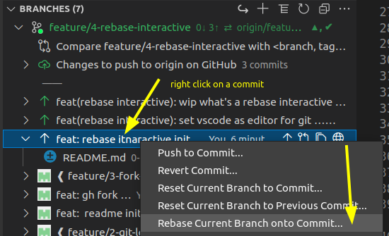
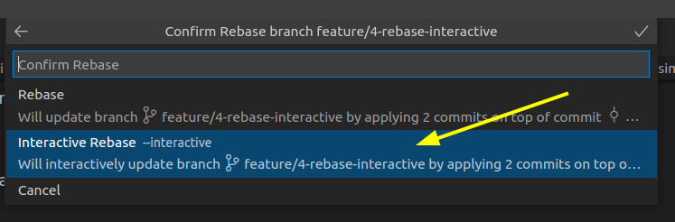
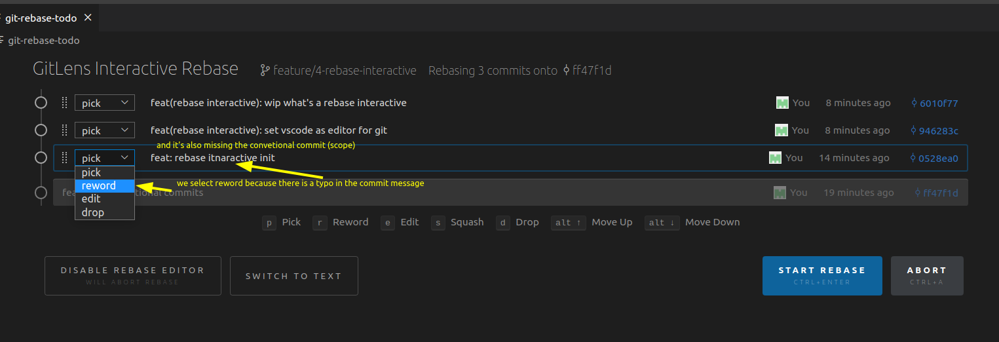
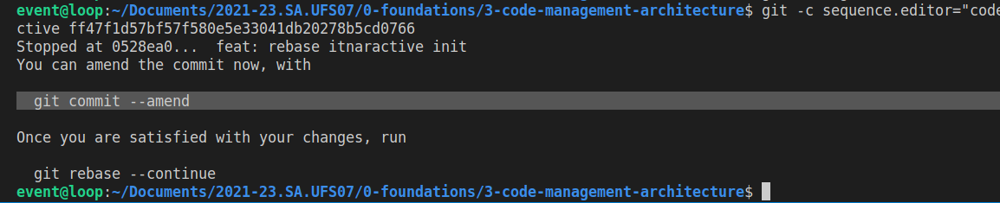
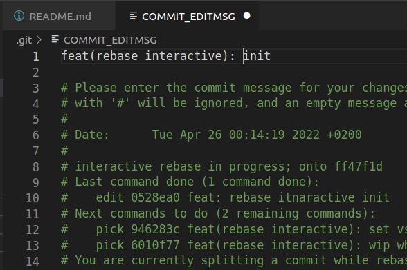
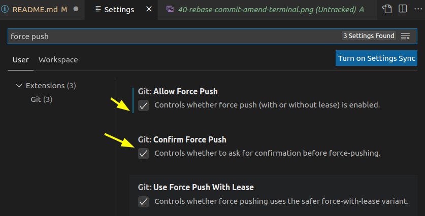
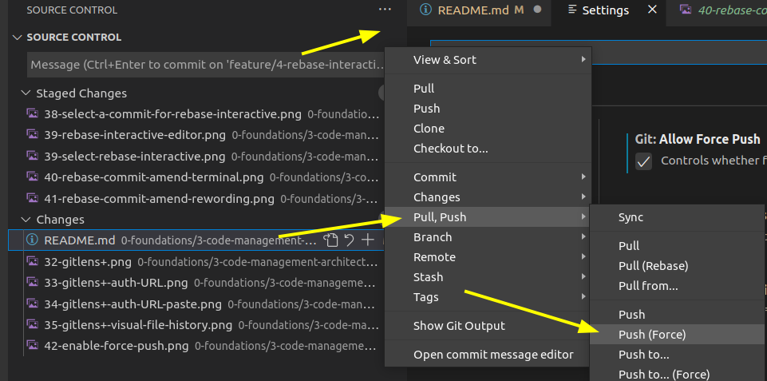

# 4 rebase interactive

The rebase interactive, and rebase in general, is one of the most advanced (and misunderstood) features of Git.

Welcome to the Gid paradise.

https://git-scm.com/docs/git-rebase

## enable VSCode as default
### rebase interactive editor

`git config --global sequence.editor "code --wait"`

### code editor

`git config --global core.editor "code --wait"`

## what's rebase interactive

rebase interactive is a command that enable us to rewrite commit history (eg. change message or change changes :) )

to do that we need to tell how many commit behind the HEAD we want to rebase

is not mandatory edit all the commit we select for rebase but because every commit is linked with the previous if we want to edit a commit that sits 5 commits ago we need to select for the rebase also the 4 commits after it

from the terminal we can do for example

`git rebase -i HEAD~6`

to start rebasing the past 5 commits

or we can do

`git rebase -i {commit hash}^`

the "^" tell _pick the commit before {commit hash}_ in that way we can include {commit hash} for the rebase interactive

### Or simply we can use the VSCode GUI

Right click on the commit from we want to start rebasing

**NB: as the terminal command shown before we need to start rebasing from the previous commit of the commit we want to edit because the rebase will propt to edit the following commits excluding the one from we start rebasing because it thread _as the new base_"

Then select interactive

Now the magic, we can choose what we want to do with our rebasing commits

Now we need to look at our terminal, Git is telling us something...

so we need to launch in our terminal

`git commit --amend` to be able to reword the commit that have typo in the message

after we run the amend command the VSCode editor pop with a temporary file that is used to edit the commit message

so we need to edit as the above screenshoot show, save and close the editor tab.

After we clone we can use `git rebase --continue` to go over.

Our rebase interactive was configured to act on a single commit so it will not ask anything to us and will show a successfull message.

Now that we have edited the history we need to push _force_ to our remote repository

we can do a force push from the terminal with

`git push -f`

or from VSCode but we need to enable it from the settings

and then

**NB: push force will _REMOVE_ history from the remote repository and will write the new history we're pushing; use it with caution**
