# 3 GitLens command palette

## opening the palette

When we press CTRL+SHIFT+G in the bottom status bar of VSCode will appear a message "waiting for a chord..."

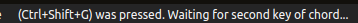

our chord for opening the palette is /

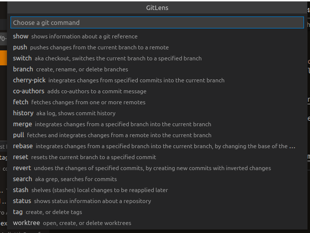

## search commits

typing "searc" the palette will do a filter on commands, selecting _search_ and press ENTER we can able to enter the search submenu

from the search submenu we can choose "Search by message" and then use "feat" as a search string to find every commit that have "feat" in the message

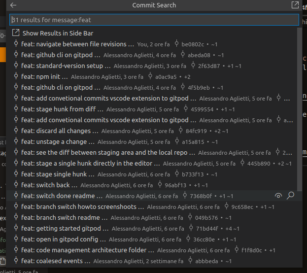

we can also search by file, for example looking for every commit that have edited any md file with `*.md`

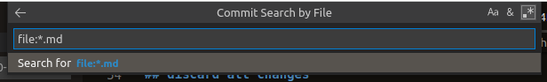

or we can search by changes refining to every commit that have change a specific text, for example every commit that have introduced or removed `<img` html tags

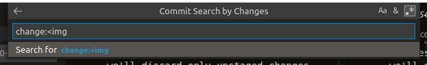

## status

the status command will show fi we have changes in our working directory and if we have commits that aren't pushed to the remote

## history

the history command is useful to navigate and full text search inside branches, tags and commits

open the history command
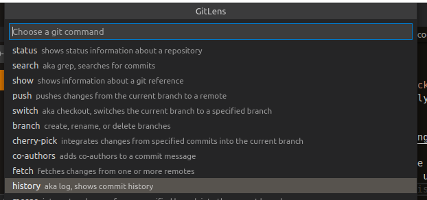

search for branch that have "feature" in the branch name
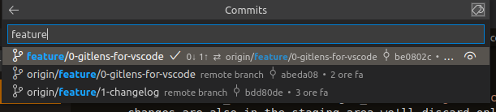

search for commits that have "switch" in the message
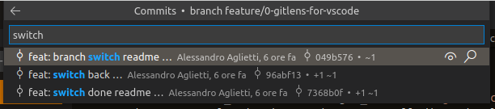

when we reach the last commit menu' we can do a lot of things for example show the commit in the sidebar

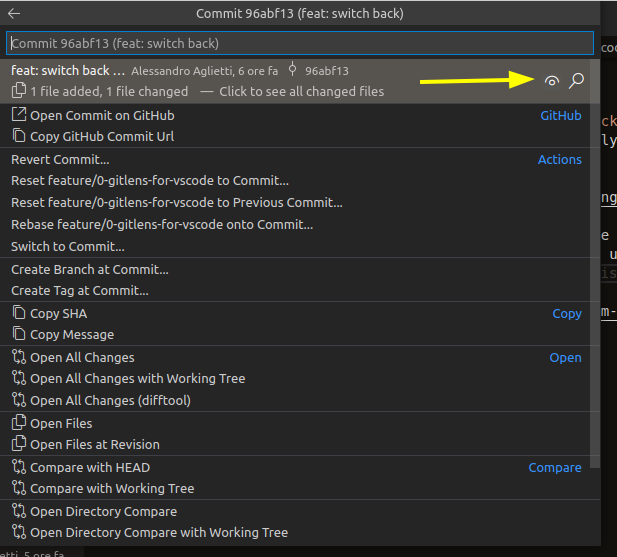

## stash

the stash action put aside every change we haven't commited yet.

Is very useful to save something we didn't want to commit but also we didn't want to lose

Give a try editing a file, save it and then use the GitLens palette to stash changes.

After we select _stash_ from the palette we'll ask which stash operation
- push means create a new stash
- list means list all saved stash
- apply means apply change from a stash to our working directory
- drop means delete a stash
- pop means apply change from a stash and remove the stash from the stash list

in our case we want to push a stash
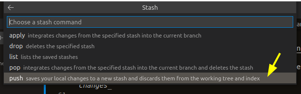

now the command palette ask us something about the push operation, we'll select the first that act as follow
- save changes in the stash
- remove changes from our working directory

as we can see there are other options available
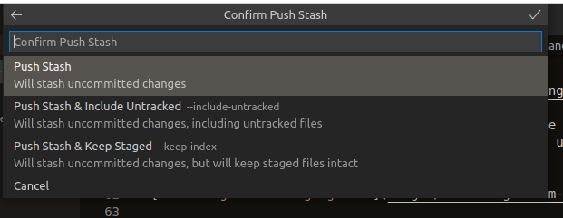

after we pushed a stash we can see it from the sidebar
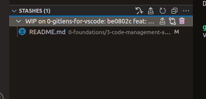

# NEXT: fork the repo and commit something
