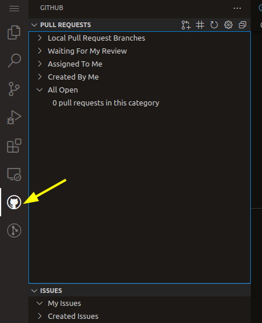
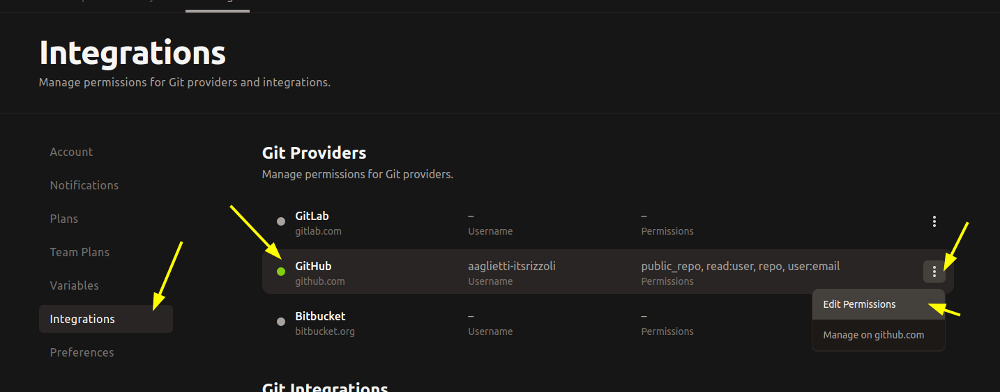
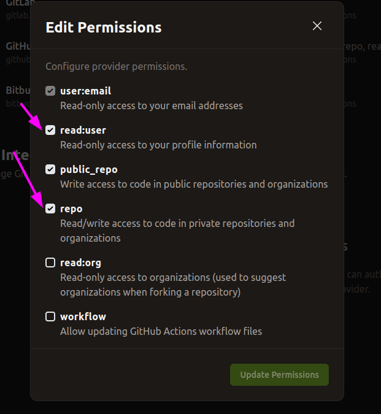
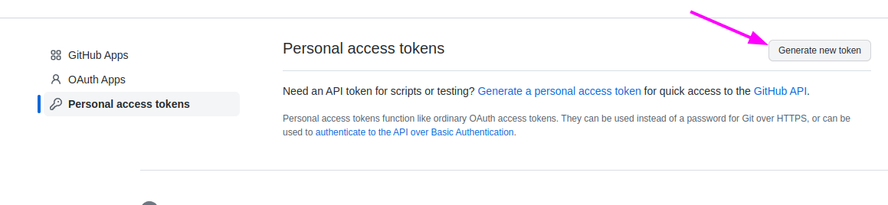
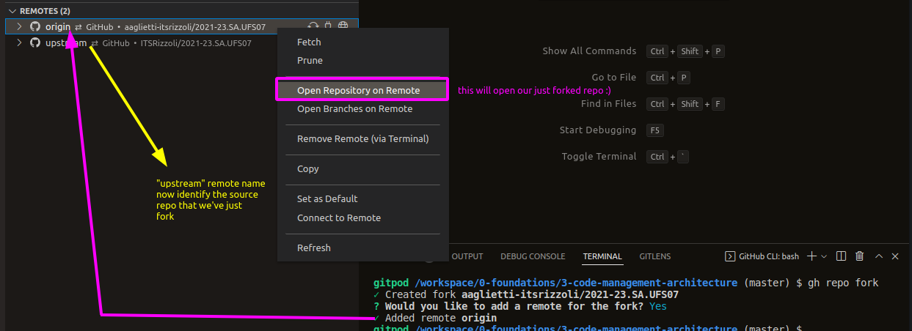
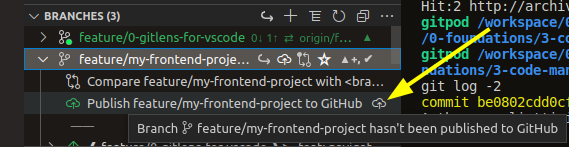
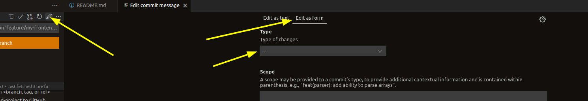

# 4 fork, branch and commit

## Enable GitHub sidebar

Click the GitHub sidebar, GitPod will ask some authorization and it will fail.

We need to go on https://gitpod.io/integrations and edit the permission on the GitHub integration.

selecting permission as follow

click _Update permissions_ and go back to the GitHub sidebar on your GitPod.

Now it'll go straight and show your GitHub Pull Requests and Issues for this repo (nothing for now).

## GitHub CLI login

To fork a repo we can do it from the GitHub interface or from the GitHub CLI.

We'll use the GitHub CLI :)

So to start we need to login on the GitHub CLI, type `gh auth login` in the VSCode terminal and answer as follow

### Create the token for the GitHub CLI login

Open https://github.com/settings/token as suggested by the CLI message then

then select permissions

finally paste the token to the CLI.

## Repo fork with the GitHub CLI

Simple type `gh repo fork` in the terminal.

**From now the new default remote repository is our fork.**

# Create a new branch

Using the GitLens command palette create a new branch and switch on it.

Then from the branch sidebar publish it to GitHub.

Now you can right click on the new remote origin and select _Open branches on remote_ to check you just published branch.

## Commit your UFS07 frontend project

So let's create a folder _UFS_ at the top of this repo.

Create also a _07_ folder inside the _UFS_.

Add a .gitkeep empty file in the _07_ folder.

Stage the .gitkeep file.

Now it's time to write our commit message, click the pen icon and...

This _magic_ convetional commit form is here because our VSCode GitPod include this VSCode extension

https://marketplace.visualstudio.com/items?itemName=adam-bender.commit-message-editor

After we have confirmed our commit we can right click on it and use _Open commit on remote_ to see it on GitHub.

## Add a folder under the 07 one with the frontend project

Now we need to version the source code of your frontend project.

So create a new folder `UFS/07/vanilla-html-css-js` and add here the project you've developed for the previous part of the UFS07 module.

**NB: is better to split this operation in different commits**

when you've finish push to remote origin.

# NEXT: rebase interactive

Without (!!!!) switch the branch open the revision of this file at the head of the 4-rebase-interactive branch
