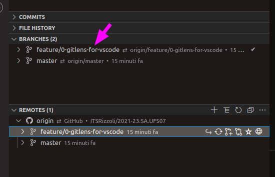
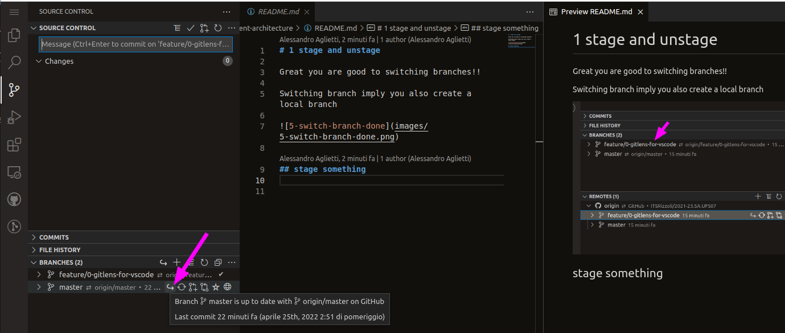
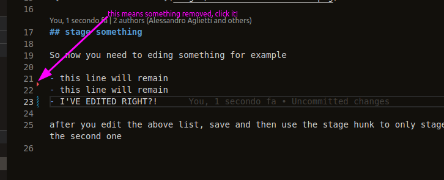
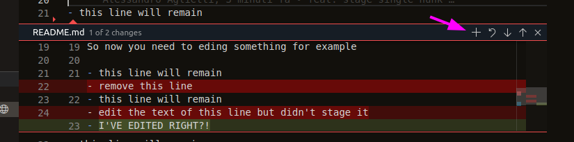
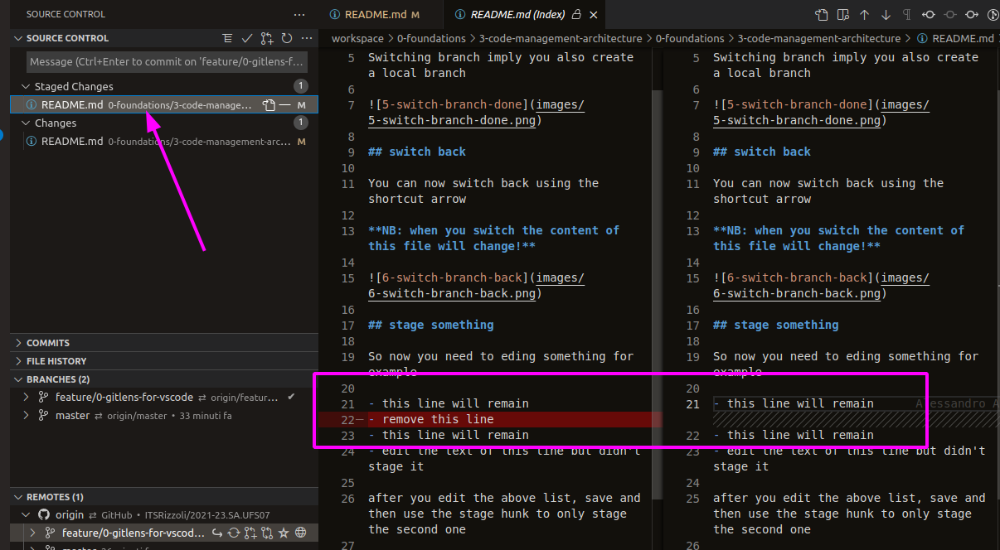
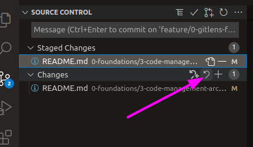
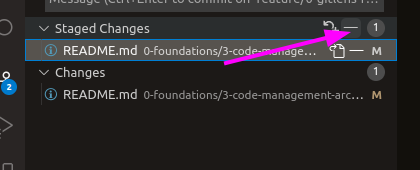
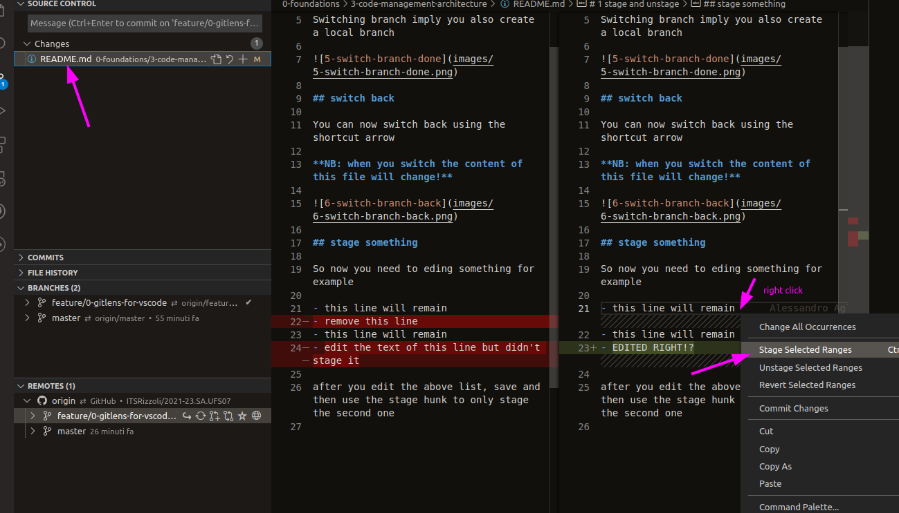

# 1 stage and unstage

Great you are good to switching branches!!

Switching branch imply you also create a local branch

## switch back

You can now switch back using the shortcut arrow

**NB: when you switch the content of this file will change!**

## stage a single line directly in the editor

So now you need to eding something for example

- this line will remain
- remove this line
- this line will remain
- edit the text of this line but didn't stage it

after you edit the above list, save and then use the stage hunk to only stage the second one.

To open the Git action menu' only for a single change you need to click on the right to the source code near line numbers
- red triangle means line removed
- blu highlight mean changes
- red highligh mean additions

On the top right of the popup you'll find some useful actions.

The + will add to our staging area only a single line.

## see the diff between staging area and the local repo

after that you'll some changes on the sidebar, the GUI tell us that something is staged and something not.

If we want to see the diff on what's staged we need to click on the file and a diff will be opened. (same as `git status --staged`)

## unstage a change

If we click the "-" on the right of the staged file the changes will be removed from the staging area (same as `git reset`).

## discard all changes

If we use the _Discard all changes_ (same as `git checkout .`) while our changes are also in the staging area we'll discard only unstaged changes (so our edit at the fourth element of the list).

To discard also what we have staged we need to unstage all changes (same as `git reset .`) that are in the stgaging area and then use the _Discard all changes_

## stage hunk from diff

When we made a lot of edits would be not easy to find them along our edited files.

We can click the file under the Changes to open a side by side diff.

Doing that we can review changes and add them to the staging area selectively.

# NEXT: navigate between file revisions

switch on feature/1-navigate-between-file-revisions
