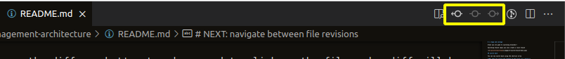
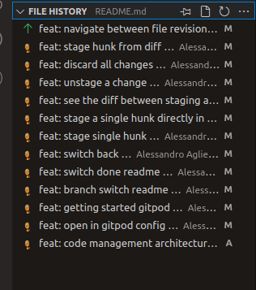
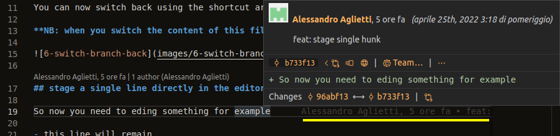
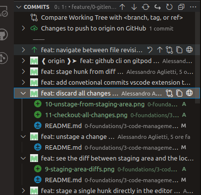

# 2 Navigate between file revisions

## using the per file revision navigation

Use those buttons to show the history of a file

## using the sidebar file history

we can also use the sidebar file history to se all the commits that have changed the current file

with right click on a commit we can do a lot of things
- open file at revision
- open change with various modes (eg. compare the version of the file with other versions)

## inline git blame

the git blame tool enable us to see for every line of a file the last commit that has edited the line

overing the blame grey message will popup a infobox

from the infobox we can learn about the commit and we can also
- open the changes at the previous commit
- open the blame at the previous commit

## commits sidebar
the sidebar commit is also useful to understand what happen from commit to commit
### show every file changed in a commit

from the sidebar for each commit we can see every file changed and we can open the diff.

we can also open a file with the content at a specific revision

## links from terminal to code

another useful feature is the ability to open a file, a commit or other git stuff from the terminal to the editor

for example if we run `git log -2` in the terminal to show te last two commits we can CTRL+click some links

# NEXT: the GitLens command palette

Switch on feature/2-git-lens-command-palette to go over.
