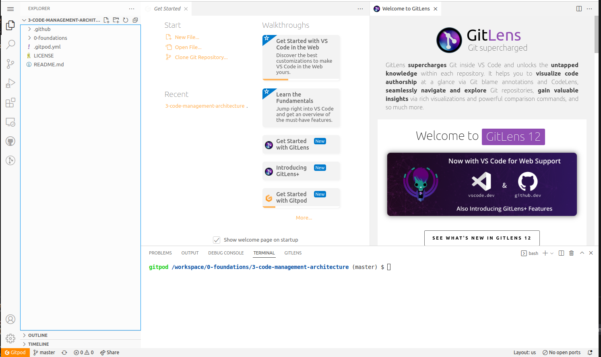
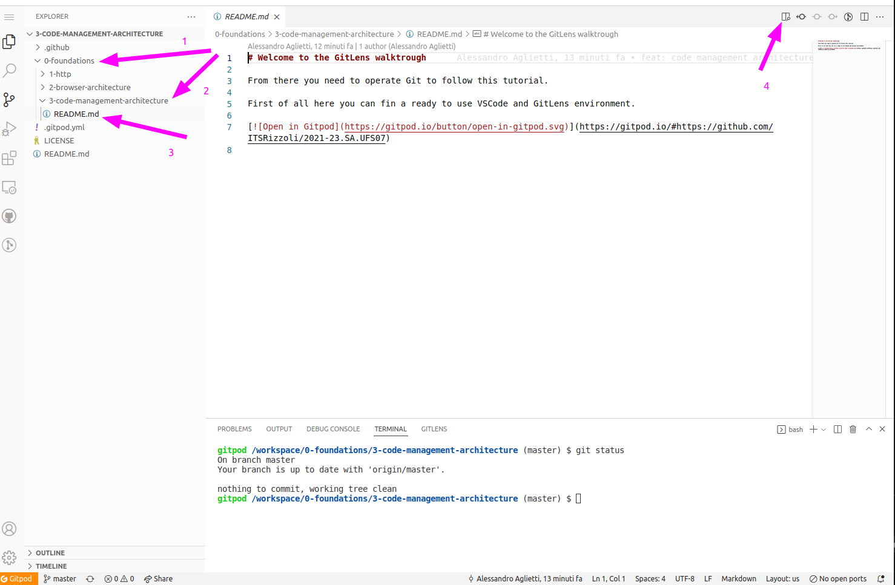
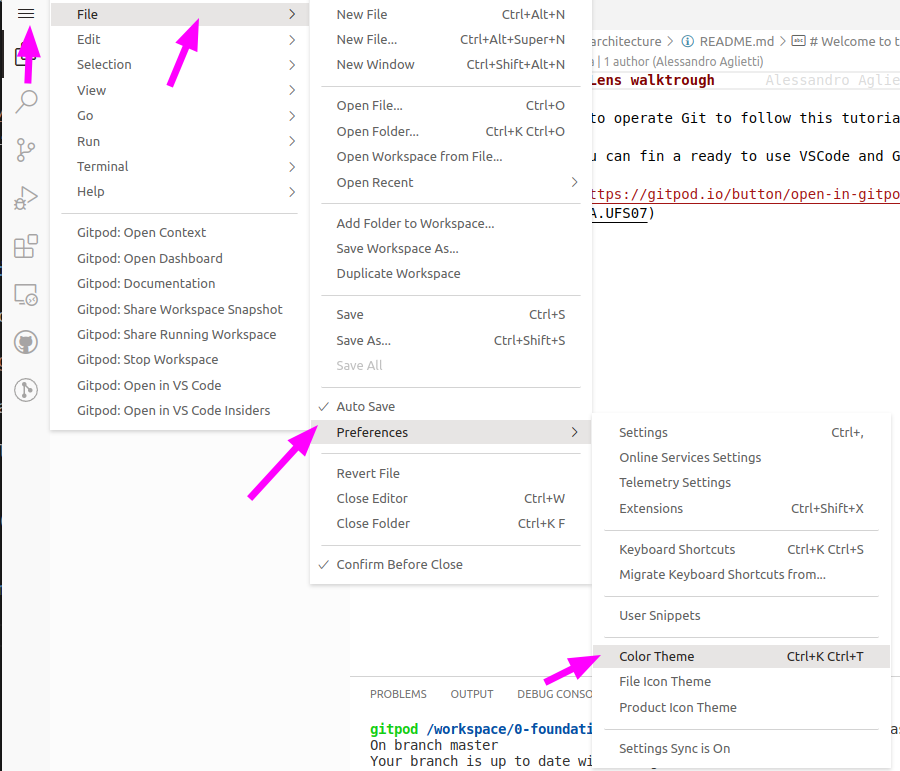
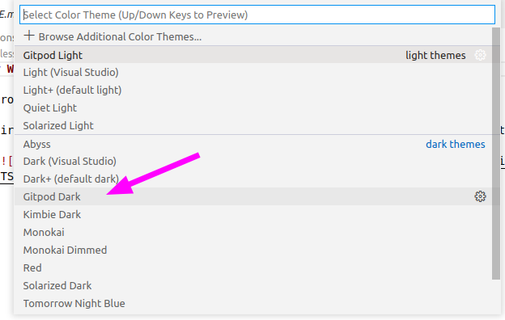
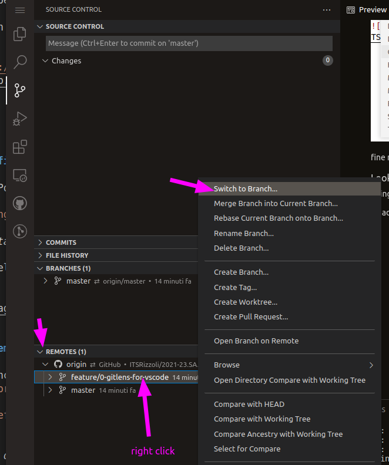

# Welcome to the GitLens walktrough

From there you need to operate Git to follow this tutorial.

First of all here you can fin a ready to use VSCode and GitLens environment.

## Walktrough

### Check everything is fine

When you're ready in GitPod you'll see something like

You can close the _Get started_ and _Welcome to GitLens_ tabs.

Then using the right panel you can open again this file a follow from there.

### Change the VSCode theme

Open theme color preferences (also possibile with CTRL+SHIFT+P command palette looking for `color theme`)

and change it to _GitPod dark_

fine now we can go over!

### Looking for other branches

Using the _Source Control_ sidebar we can look for other branches on this repo.

To advance to the next step we need to switch to `feature/0-gitlens-for-vscode`

